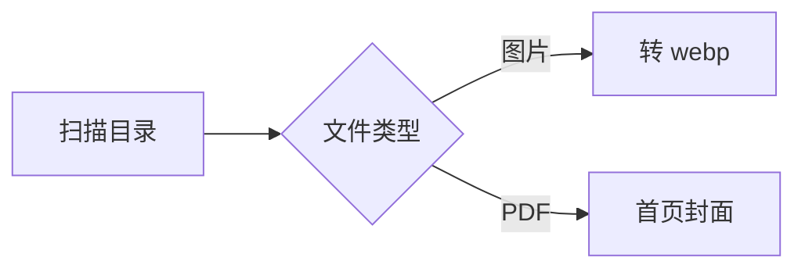

这是一篇用于验收的示例文档：文首的标题、日期、标签由 front matter 生成，目录来自 `toc: true`。

## 基础排版

正文支持 **加粗**、*斜体*、~~删除线~~、`行内代码`、[链接](https://github.com) 与 ==高亮标记==，还有表情短码：:tada: :rocket: :100:。

> 引用块：左侧强调条 + 浅色底，适合放备注与摘录。

1. 有序列表
2. 有序列表
   - 嵌套无序
   - 嵌套无序
3. 有序列表

## 任务列表

- [x] front matter 头部与博客化排版
- [x] 代码高亮与行高亮
- [ ] 待办：把这份示例换成你自己的笔记

## 代码与行高亮

```js {2,5}
const kb = async (dir) => {
  const files = await scan(dir);       // ← 高亮行
  return files.map((f) => f.name.toLowerCase());
};
const exts = ['.md', '.pdf', '.epub']; // ← 高亮行
```

```bash
npm run kb:index   # 扫描双库，转 webp、生成封面、改写 md 引用
```

## 自定义容器

::: tip 标题-提示
这是一个 tip 提示容器。
:::

::: info 标题-信息
这是一个 info 信息容器。
:::

::: warning 标题-警告
这是一个 warning 警告容器。
:::

::: danger 标题-危险
这是一个 danger 危险容器。
:::

::: details 标题-查看代码
这是 details 折叠卡，点开才显示内容：

```js
console.log("查看代码");
```

:::

## 选项卡

:::: code-group

::: code-group-item npm

```bash
npm install marked katex
```

:::

::: code-group-item pnpm

```bash
pnpm add marked katex
```

:::

::::

## 表格

| 类型 | 预览方式 | 上限 |
| ---- | :------: | ---- |
| 图片 | 弹窗灯箱 | - |
| 音视频 | 原位播放 | 50MB |
| 电子书 | 阅读器 | - |

## 数学公式

$$
1rem = \frac{clientWidth}{750}
$$

行内公式如 $E = mc^2$ 也可以。

## 图片尺寸


## Mermaid 图表



> 图片位于 assets/ 目录：kb-index 会自动转 webp 并把上面的引用改成 .webp。
